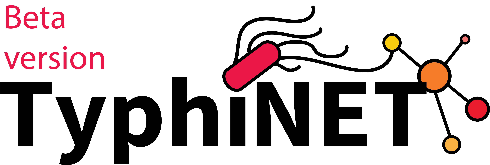

   
  # TyphiNET web dashboard
   
   
   
   
   
   
  

  ## Table of Contents

  * [Description](#Description)

  ## Description

  TyphiNET is a dashboard for visualising global *Salmonella* Typhi genotype and antimicrobial resistance data.  Our interface allows you to search for specific data on individual countries, and over specific time periods.  Data are regularly updated (last updated November 5th 2020) from [Pathogenwatch](https://pathogen.watch/).
  
  ## Site
  
  [Here](http://typhinet.erc.monash.edu/)
